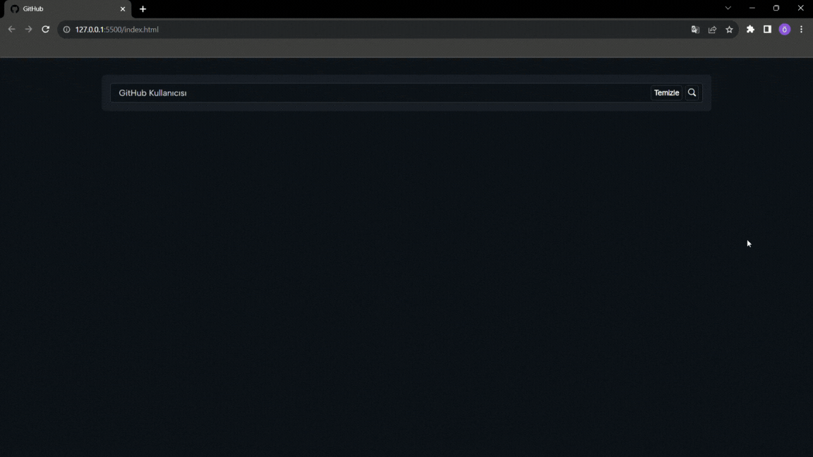

# GitHub Profile Card Project

- Bu projede kullanıcıdan aldığımız kullanıcı adı ile API'a istek atarak kullanıcının GitHub bilgilerini ekrana renderladık.

- Axios ile API'a isteklerimizi atarak Axios ile pratik yaptık.

## Özellikler

- Kullanıcının Github API'dan aldığımız bilgilerini ekrana aktartardık.

- Temizle butonu ile kullanıcının ekranda ki bilgilerini temizledik.

- Kullanıcın repolarını ekrana aktararak daha kolay bir şekilde ulaşmasını sağladık.

## Kullanılan Teknolojiler

- HTML

- SCSS

- JavaScript

## Gif

